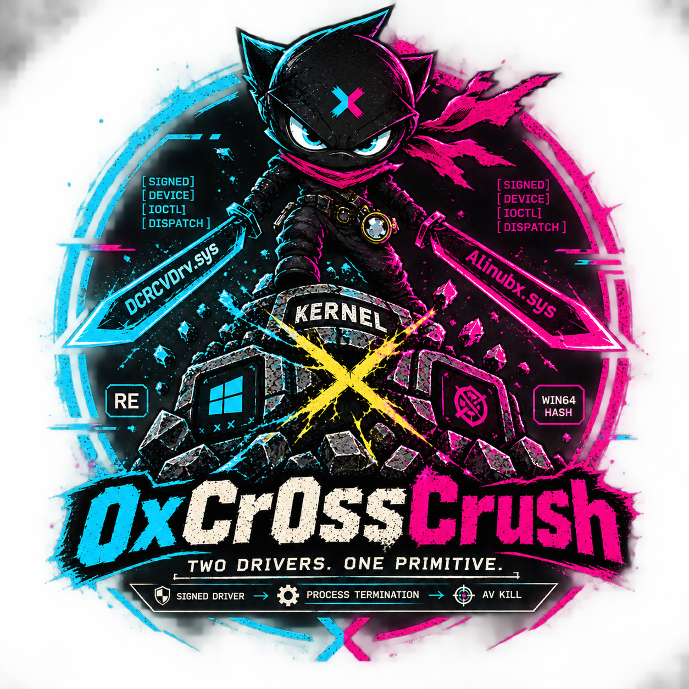
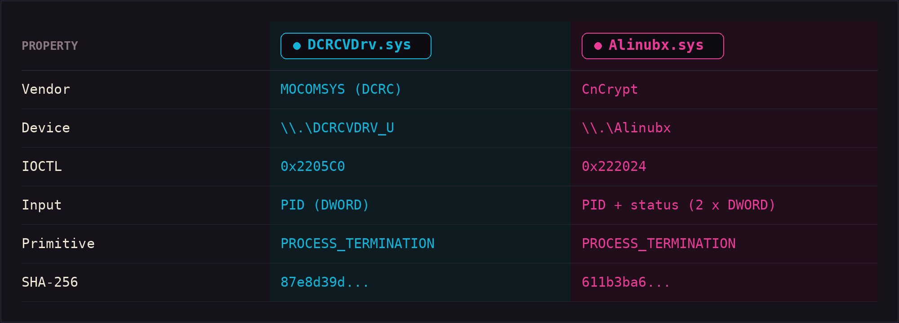
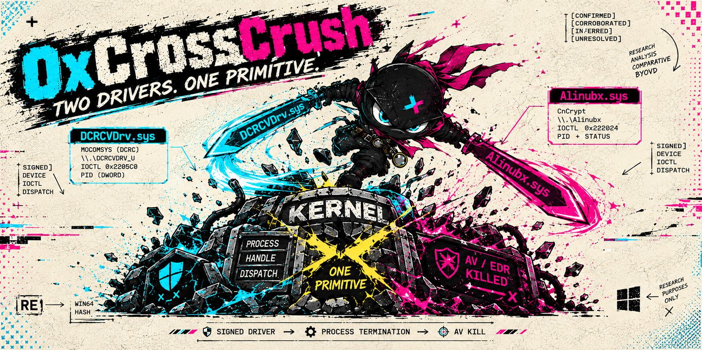
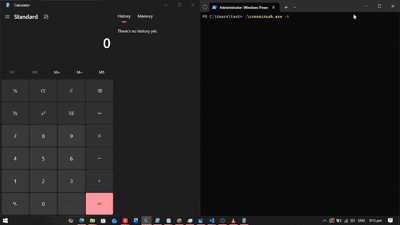
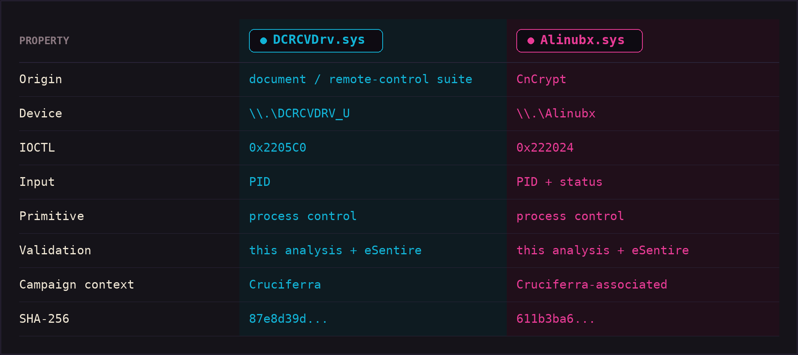
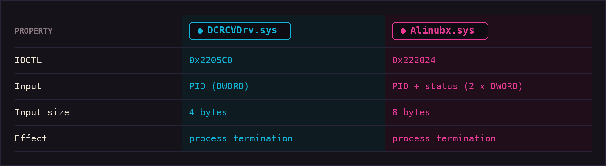
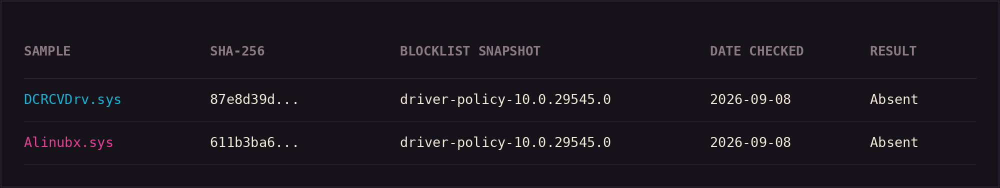

# 0xCr0ssCrush

Two signed drivers. One dangerous kernel primitive. 0xCr0ssCrush is a
Windows BYOVD research project covering the DCRCVDrv.sys and Alinubx.sys
drivers abused by the Cruciferra malware-as-a-service loader: their
interfaces, their kernel primitives, their provenance, and how to
detect and defend against their abuse.

<p align="center">
  
</p>

<br>

## What is 0xCr0ssCrush?

A research harness and analysis package for two vulnerable signed
drivers:

<p align="center">
  
</p>

<br>

> The repository reproduces the operators' own redundancy tactic: if one
> driver is refused by the host, the harness falls back to the other.

<br>

<p align="center">
  
</p>

## Why this matters

Both drivers were documented by eSentire's Threat Response Unit in
August 2026 as components of the Cruciferra malware-as-a-service
loader, which terminates AV/EDR processes before payload delivery.
These are not hypothetical primitives - they are abused in the wild,
they are signed, and neither file was present in Microsoft's
enforced vulnerable-driver blocklist at the time of this research.

## Demo

<br>

<p align="center">
  
</p>

<br>

Controlled-lab run: driver selection, hash validation, target
resolution, and the termination IOCTL path on a Windows 11 lab host.
See docs/reproduction.md for the exact procedure.

## Research contribution

0xCr0ssCrush does not claim discovery of the underlying vulnerable
drivers. Its contribution is a reproducible comparative research
implementation covering two recently abused signed Windows drivers,
their exposed interfaces, kernel primitives, provenance,
environmental behavior, and defensive detection opportunities.

No publicly indexed implementation matching both driver interfaces
was identified during our research.

The independent support for the findings:

- DCRCVDrv.sys device, IOCTL, and termination chain - eSentire TRU
  Cruciferra report (2026-08-19).
- Driver catalogs - LOLDrivers (entries 2026-08-27).
- Blocklist absence - snapshot dated 2026-09-08, reproducible in
  docs/blocklist-status.md.

## Cross-driver comparison

<p align="center">
  
</p>

<br>

Full matrix and IOCTL surface in [docs/ioctl-reference.md](docs/ioctl-reference.md).

## DCRCVDrv.sys

Signed driver from MOCOMSYS (DCRC) carrying WFP callout strings and a
child-process monitor. The exposed device `\\.\DCRCVDRV_U` accepts a
termination IOCTL from user mode. Analysis:

- Device: `\\.\DCRCVDRV_U`
- IOCTL: `0x2205C0`
- Input: 4-byte PID
- Chain: handle acquisition (ZwOpenProcess / PsLookup) ->
  ObOpenObjectByPointer -> ZwTerminateProcess

Details in [docs/dcrcv-analysis.md](docs/dcrcv-analysis.md).

## Alinubx.sys

Signed driver from CnCrypt with WFP/ALE callout strings. The exposed
device `\\.\Alinubx` accepts a termination IOCTL taking a PID and an
exit status.

- Device: `\\.\Alinubx`
- IOCTL: `0x222024`
- Input: `{ pid: DWORD, exit_status: DWORD }`
- Chain: PsLookupProcessByProcessId -> ObOpenObjectByPointer ->
  ZwTerminateProcess

Details in [docs/alinubx-analysis.md](docs/alinubx-analysis.md).

## Kernel primitive analysis

Both drivers expose the same primitive family:

```
primitive_family: PROCESS_CONTROL
primitive:        PROCESS_TERMINATION
```

The machine-readable classification lives in
[metadata/drivers.json](metadata/drivers.json) so additional drivers
can be added without restructuring the repository.

## IOCTL map

<p align="center">
  
</p>

<br>

Complete dispatch analysis (including the observed additional
DCRCVDrv.sys surface) is in [docs/ioctl-reference.md](docs/ioctl-reference.md).

## Reverse-engineering evidence

Every claim in the writeup carries an evidence label:

```
[CONFIRMED]      directly established from code/disassembly
[CORROBORATED]   observed here and independently supported
[INFERRED]       likely but not fully proven
[UNRESOLVED]     current evidence insufficient
```

Annotated disassembly excerpts (import capture, IOCTL dispatch,
termination helper, strings) are included under
[analysis/](analysis/) so the analysis can be re-walked.

## Reproduction / controlled lab

Build, then never load a driver without hash validation - the harness
itself enforces this:

```
cargo build --release --target x86_64-pc-windows-gnu
crosscrush.exe -d -n "notepad.exe"        # dry run, no IOCTLs
crosscrush.exe -n "notepad.exe" -k dcrc   # single driver
```

Step-by-step procedure and lab hygiene in
[docs/reproduction.md](docs/reproduction.md).

IOCTL-accepted and process-stopped are two distinct observations; the
reproduction guide makes this explicit.

## Detection

Sigma, YARA, and telemetry guidance:

```
detection/
|-- sigma/driver_load_win_cruciferra_byovd.yml
|-- yara/cruciferra_drivers.yar
+-- telemetry/README.md
```

Detection strategy in [docs/detection.md](docs/detection.md).

## Windows compatibility

Observed state is recorded per build in
[lab/test-matrix](lab/test-matrix/README.md) and marked as Verified /
Not tested / Blocked / Unknown. Currently verified on Windows 11 24H2
(build 26100) with HVCI disabled. No blanket compatibility claims are
made.

## Blocklist status

<p align="center">
  
</p>

<br>

Snapshot-specific and reproducible: [docs/blocklist-status.md](docs/blocklist-status.md).

## Driver provenance

Hash-specific provenance for every sample in the repository:

```
metadata/
|-- drivers.json    # driver registry
+-- samples.json    # sample registry (acquisition, verification)
```

Validated against the documentation by
[scripts/validate_metadata.py](scripts/validate_metadata.py).
Details in [docs/driver-provenance.md](docs/driver-provenance.md).

## Repository structure

```
|-- README.md / WRITEUP.md / THREAT_MODEL.md / RESEARCH_NOTES.md
|-- CHANGELOG.md / SECURITY.md / LICENSE
|-- docs/          analysis, IOCTL reference, provenance, detection
|-- src/           research harness
|-- analysis/      annotated disassembly artifacts
|-- detection/     sigma / yara / telemetry
|-- lab/           test matrix and manifests
|-- metadata/      machine-readable driver and sample registry
|-- scripts/       metadata validation
+-- .github/       CI and release workflows
```

## Limitations

- Process-protection (PPL) targets were not terminable through these
  interfaces during testing; the writeup documents the limit.
- Alinubx.sys exit-status propagation is [INFERRED] (the harness
  sends the normal-termination value 0).
- Device DACL behavior and some DCRCVDrv.sys handle-source branches
  remain [INFERRED]/[UNRESOLVED]; see the analysis documents.
- Blocklist status is snapshot-specific.

## References

- eSentire TRU - Malware-as-a-Service Cocktail: ErrTraffic and
  Cruciferra - Killing Your EDR Since 2025 (2026-08-19)
- LOLDrivers - 89643454-e38b-41cb-853d-abf649a104a5,
  84a3007a-de5e-4622-bfc5-f05d927c3618 (2026-08-27)
- Microsoft - aka.ms/VulnerableDriverBlockList (snapshot 2026-09-08)

## Responsible use

This project exists for research and defense. Load these drivers only
on systems you own or are authorized to test; loading them elsewhere
is illegal in most jurisdictions. See [SECURITY.md](SECURITY.md) and
[THREAT_MODEL.md](THREAT_MODEL.md).